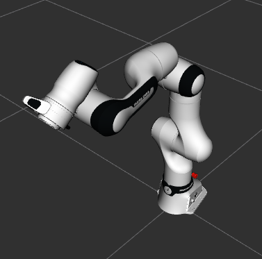
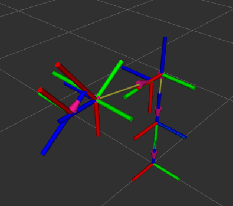
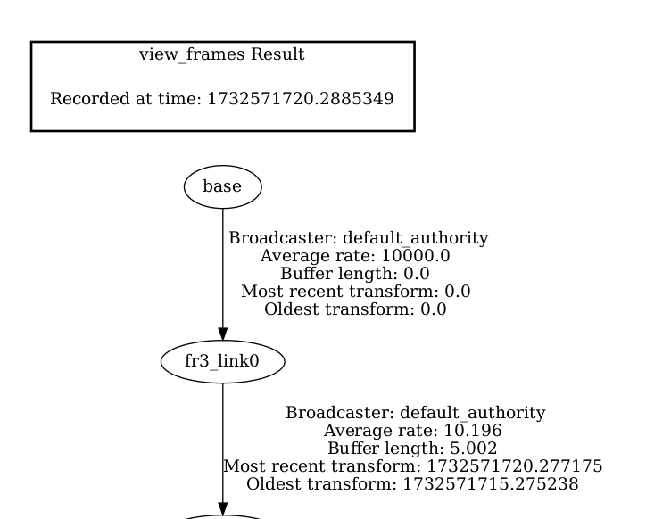

# COMP0246_Labs - Lab 1 for submission

This repo holds lab(s) for COMP0246. It uses ROS2 humble.

## lab0_transforms



This document contains a task on writing code for broadcasting the state of a robot with tf2. The documentation for this library (for ROS2 Humble) can be found [here](https://docs.ros.org/en/humble/Tutorials/Intermediate/Tf2/Introduction-To-Tf2.html). 
When doing tasks with a robot it is crucial that the robot be aware of where it is itself as well as where the rest of the world is in relation to itself. Having that information, the programmer could simply request from a library what is the vector that they need to perform a specific task, e.g. moving a gripper of a robot with respect to its main body, in order to grasp some target. This is where the ‘tf’ library comes in.

The ‘tf’ library was designed to provide a standard way to keep track of coordinate frames and transform data within the entire system such that individual component users can be confident that the data is in the coordinate frame that they want without requiring knowledge of all the coordinate frames in the system. ‘tf’ maintains the relationship between coordinate frames in a tree structure buffered in time, and lets the user transform points, vectors, etc., between any two coordinate frames at any desired point in time. In a few words, ‘tf’ is a library for keeping track of coordinate frames.

  

The ‘tf’ library is most closely related to the concept of a scene graph (a common type of data structure used to represent a 3D scene for rendering). Essentially, the library provides a transform between two coordinate frames at a requested time. 

* ‘tf’ is closely represented by a tree
Transforms and coordinate frames can be expressed as a graph with the transforms as edges and the coordinate frames as nodes. However, with a graph, two nodes may have multiple paths between them, resulting in two or more potential net transforms introducing ambiguity to the problem. To avoid this, we limit the ‘tf graph’ into a ‘tf tree’. This is why, although the ‘tf’ library can be closely associated with a scene graph, it is most closely represented by a tree that is designed to be queried for specific values asynchronously, has the benefit of allowing for dynamic changes to its structure and each update is specific to the time at which it was measured.

  

* ‘tf’ stamp
To be able to operate, all the data which is going to be transformed by the ‘tf’ library must contain two pieces of information: the coordinate frame in which it is represented, and the time at which it is valid. These two pieces of data are referred to as a ‘Stamp’. Data which contains the information in the ‘Stamp’ can be transformed for known data types.
* transforms can be static without a moveable joint. These are often published to the `/tf_static` topic. They can also be dynamic, with a moveable joint, often published to the `/tf` topic.


### step 0
This lab depends on some stuff like tf2 and rviz2. rosdep documentation is available [here](https://docs.ros.org/en/rolling/Tutorials/Intermediate/Rosdep.html). You can install this via rosdep. If you haven't installed this before, install rosdep. If linux `sudo apt-get install python3-rosdep` else `pip install rosdep` may work or do your own research. 

Once installed, if you've never used it:
```
sudo rosdep init
rosdep update
```

Then to install dependencies, from the root of this repository:
```
rosdep install --from-paths ./ -y --ignore-src
```

### step 1

Try using ROS's implementation of forward kinematics for a robot arm, via the [Robot State Publisher](https://github.com/ros/robot_state_publisher/tree/humble). The below will bring up rviz2 as well as a GUI where you can adjust the joint angles of the robot arm. Try changing the joint angles and seeing what happens to the position of the end effector!


```
mkdir -p ros2_ws/src
cd ros2_ws
git clone https://github.com/surgical-vision/COMP0246_Labs src/COMP0246_Labs
colcon build
source install/setup.bash
ros2 launch transform_helpers bringup.launch.py
```

### step 1.5

While the default setup is running, check out the transforms by going to a new terminal and running the below. After a couple seconds this should spit out a PDF you can open to view the transform hierarchy. What is the name of the wrist joint in this hierarchy?
```
ros2 run tf2_tools view_frames
```

### step 1.6

Checkout some of the transforms being published. What representation does ROS use for orientation?
```
ros2 topic echo --once /tf
```

### step 1.7
The URDF file is a way to represent a robot. It has a series of rigid links that are connected by joints. How many links do you see in the URDF file [here](./franka_description/urdfs/fr3.urdf) and why is this more than 7, the number of joints that the robot has? [This](https://docs.ros.org/en/rolling/Tutorials/Intermediate/URDF/Building-a-Visual-Robot-Model-with-URDF-from-Scratch.html) may be helpful in background on URDF files.

### step 2

Now we will implement our own forward kinematics using Denavit-Hartenberg parameters. We can find them for the Franka FR3 robot arm [here](https://frankaemika.github.io/docs/control_parameters.html#denavithartenberg-parameters) which uses the Craig convention meaning modified DH parameters. We will try to mimick the behavior we saw in step 1. The file in this repo [here](./transform_helpers/transform_helpers/main.py) has some starter code and some TODO items for you. Implement this file, then rebuild the package and run the `ros2 launch transform_helpers bringup.launch.py` command and in a new terminal run the program you just wrote `ros2 run transform_helpers main`.

From here we will change some of the RVIZ configuration, specifically the transform prefix, to point to our new transforms we are publishing. See the configuration in the below screenshot and update your rviz config to match with attention to the transform prefix as well as the fixed frame in rviz.


Now change the joint angles in the GUI and you should be able to see the robot changes states, and now your transforms are driving this. Behavior should match Step 1, so you can check your work.
